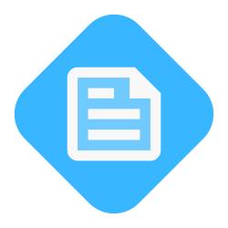

# Professional README Generator

***Created using my command line application README.md file generator!***

[](https://choosealicense.com/licenses/mit/) [](https://www.github.com) [](mailto:testing@testing.com) [](https://www.github.com)

[Description](#description) • [Features](#features) • [Installation](#installation) • [Usage](#usage) • [Testing](#testing) • [Support](#support) • [Contributing](#contributing) • [Credits](#credits) • [License](#license)


## Description

[Back to Top](#professional-readme-generator)

Describe what prompted you to create this project.

Explain what real world problem this application fixes.

How will the intended user utilize your application to help them in their development process?

### User Story

```AS A... I WANT... SO THAT...```

### Acceptance Criteria

```GIVEN... WHEN... THEN...```


## Features

[Back to Top](#professional-readme-generator)

Highlight the key features of your application here.


## Installation

[Back to Top](#professional-readme-generator)

Describe the installation process for users.


## Usage

[Back to Top](#professional-readme-generator)

Provide examples and details on the instruction process to get up and running.

### Visuals

Include visuals such as screenshots and screen recordings to help showcase your project!


## Testing

[Back to Top](#professional-readme-generator)

Describe any tests and the testing process.


## Support

[Back to Top](#professional-readme-generator)

If you have any questions, or additional feedback, please feel free to contact me. I will get back to you as soon as possible.

*Contact Information:*

GitHub: [username](https://www.github.com)

Email: testing@testing.com

*Submit an Issue:*

If you are experiencing an issue with this application, please submit an [issue ticket](https://www.github.com).


## Contributing

[Back to Top](#professional-readme-generator)

Inform your fellow developers in the web development community on whether you are accepting help at the moment or not.

### Roadmap

Describe what you have already accomplished on this project and what your intentions are for the application and its future.

### Project Status

Explain the project's current status, such as work-in-progress, deprecated, open issues, complete, etc.

### Contribution Guidelines

There are many online resources that I encourage you to reference while writing this portion of your README.md file. Outline the rules for this community and how you expect your fellow contributors to behave.


## Credits

Here are listed the sources that helped make this project possible.

### Authors

*The following developers helped create this project:*

[Name](https://www.github.com) - Main Developer, [Name](https://www.github.com) - Contributor (Worked on [x] feature)

### Acknowledgments

*The following resources were used for inspiration and guidance during the development process:*

[Website](https://www.github.com) - Referred to for help in solving [x] issue, [Resource](https://www.github.com) - Used as inspiration for designing the layout of this application


## License

&copy; 2024 First and Last Name

This application is licensed under the [MIT License](./Samples/LICENSE).