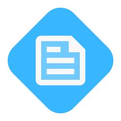

<div align="center">

<a href="./Assets/Images/README-Logo.svg"></a>

# Professional README.md Generator

<h3>A command-line application to automate your development workflow and generate a professional README.md file!</h3>

[](https://github.com/emsim11)   

[](https://github.com/emsim11/Professional-README-Generator)

<p>
<a href="#description">Description</a> • 
<a href="#features">Features</a> • 
<a href="#installation">Installation</a> • 
<a href="#usage">Usage</a> • 
<a href="#support">Support</a> • 
<a href="#contributing">Contributing</a> • 
<a href="#credits">Credits</a> • 
<a href="#license">License</a> </p>

</div>

## Description

Each time a developer creates and deploys an application for the world to use, it is best practice for them to also write a README.md file for the application. Given that writing a README.md is a large part of the development process that needs to be done often, why not use an application to streamline it?

This Node.js application does just that! Say goodbye to having to remember everything to include within the application's documentation, and say hello to a quick Q&A process that automatically generates a professional README.md for you!

Developers are constantly looking for ways to streamline their efficiency during development, and writing your application's documentation should be apart of that! From badges to display pertinent information, to sections that organize topics within the documentation, this Professional README.md Generator is here to help you as you develop your next greatest creation!

### User Story

```md
As a developer

I want a README generator

So that I can quickly create a professional README for a new project
```

### Acceptance Criteria

```md
Given a command-line application that accepts user input

When I am prompted for information about my application repository

Then a high-quality, professional README.md is generated with the title of my project and the sections entitled Description, Table of Contents, Installation, Usage, License, Contributing, Tests, and Questions

When I enter my project title

Then this is displayed as the title of the README

When I enter a description, installation instructions, usage information, contribution guidelines, and test instructions

Then this information is added to the sections of the README entitled Description, Installation, Usage, Contributing, and Tests

When I choose a license for my application from a list of options

Then a badge for that license is added near the top of the README and a notice is added to the section of the README entitled License that explains which license the application is covered under

When I enter my GitHub username

Then this is added to the section of the README entitled Questions, with a link to my GitHub profile

When I enter my email address

Then this is added to the section of the README entitled Questions, with instructions on how to reach me with additional questions

When I click on the links in the Table of Contents

Then I am taken to the corresponding section of the README
```

[Back to Top](#professional-readmemd-generator)

## Features

- Command-line application that provides prompts to answer questions about the user's README.md file

- Professional badges that are correctly linked to take viewers to see more information pertaining to the badge

- Links to the developer's LICENSE file for viewers to read the licensing of the application

- Links to the top of the page and to sections within the README.md for a faster and more interactive viewing experience

[Back to Top](#professional-readmemd-generator)

## Installation

To use this application, please fork the repository and clone the new repository in your code editor. This application requires [Node.js](https://nodejs.org/en), so please make sure to have it installed. Within your new repository folder, open the integrated terminal and type in the command `npm install` to install the Inquirer.js Node Package Manager dependency. 

Now that all of the required tools have been installed, type this command into the integrated terminal to begin the prompts: `node index.js`. Once you have finished answering the questions about the application that a README.md file is being created for, a new file will appear in the directory called `README.md`! Right-click on the file and select `Open Preview` to preview the file's rendering on websites, such as GitHub.

### Technologies

[](https://nodejs.org/en) [](https://www.npmjs.com/package/inquirer)

This application requires that Node.js is installed on your computer. It also uses the Inquirer NPM to display the questions and generate your README.md file.

[Back to Top](#professional-readmemd-generator)

## Usage

Use the Professional README Generator to quickly create high-quality README.md files for your applications and projects! Simply answers the questions in the command-line interface, and the application will do the rest! View your new README.md file in your directory after the prompts have finished! 

### Visuals

Visuals and Screenshots

[Back to Top](#professional-readmemd-generator)

## Support

[](mailto:emsimone11@gmail.com)

*Contact Information:*

If you have any questions, or additional feedback, please feel free to contact me. I will get back to you as soon as possible.

*Submit an Issue:*

If you are experiencing an issue with this application, please submit an [issue ticket](https://github.com/emsim11/Professional-README-Generator/issues).

[Back to Top](#professional-readmemd-generator)

## Contributing


This project is not allowing other contributors at this moment.

[Back to Top](#professional-readmemd-generator)

## Credits

[](https://github.com/emsim11)

Here are listed the sources that helped make this project possible.

### Authors

*The following developers helped create this project:*

[Emily Simone](https://github.com/emsim11) - Main Developer

### Repository Information

  

[Back to Top](#professional-readmemd-generator)

## License

[](https://choosealicense.com/licenses/mit/)

&copy; 2024 Emily Simone

This application is licensed under the [MIT License](./LICENSE).

[Back to Top](#professional-readmemd-generator)