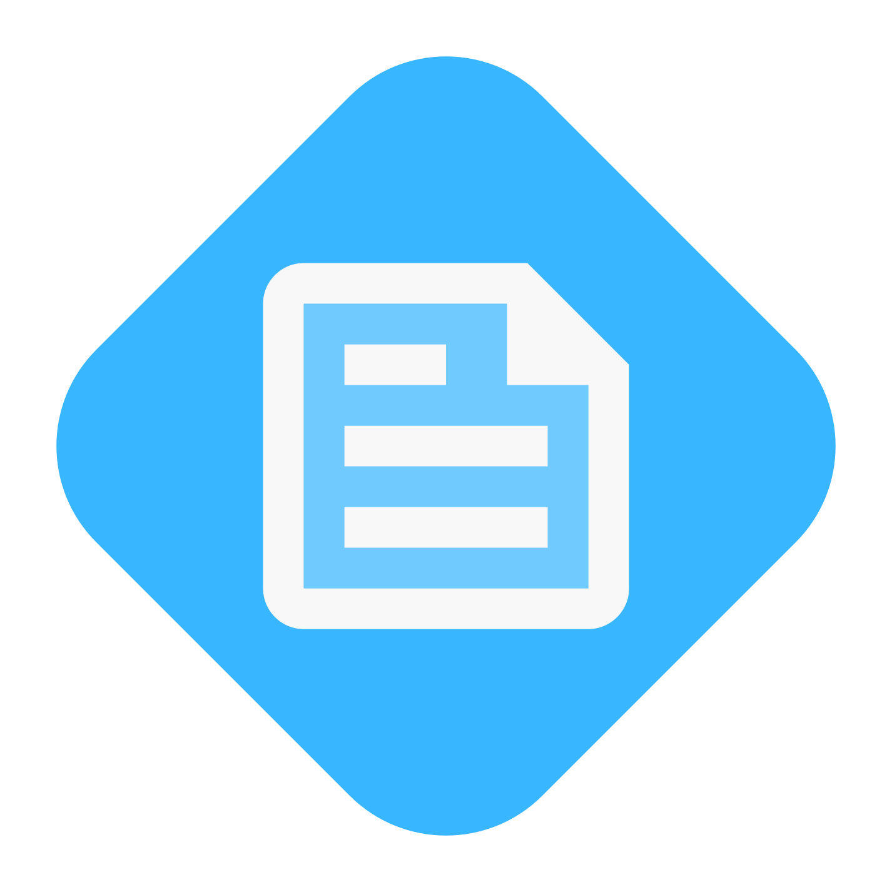

# Professional README Generator

***A command-line application to increase your development workflow's efficiency through automation!***

[](https://choosealicense.com/licenses/mit/) [](https://github.com/emsim11) [](mailto:emilysiimone11@gmail.com) [](https://github.com/emsim11/Professional-README-Generator)

[Description](#description) • [Features](#features) • [Installation](#installation) • [Usage](#usage) • [Testing](#testing) • [Support](#support) • [Contributing](#contributing) • [Credits](#credits) • [License](#license)

## Description

[Back to Top](#professional-readme-generator)

Motivation

Problem it solves

How it will be used, challenges I faced, etc.

### User Story

```
AS A...

I WANT...

SO THAT...
```

### Acceptance Criteria

```
GIVEN... 

WHEN...

THEN...
```

## Features

[Back to Top](#professional-readme-generator)

Key features

## Installation

[Back to Top](#professional-readme-generator)

Installation step-by-step process

## Usage

[Back to Top](#professional-readme-generator)

Instructions and examples for users

### Visuals

[The Professional README Generator At Work! (Walkthrough Video)](./Assets/Walkthrough-Video.mp4)

## Support

[Back to Top](#professional-readme-generator)

If you have any questions, or additional feedback, please feel free to contact me. I will get back to you as soon as possible.

*Contact Information:*

GitHub: [emsim11](https://github.com/emsim11)

Email: emilysiimone11@gmail.com

*Submit an Issue:*

If you are experiencing an issue with this application, please submit an [issue ticket](https://github.com/emsim11/Professional-README-Generator/issues).

## Credits

Here are listed the sources that helped make this project possible.

### Authors

*The following developers helped create this project:*

[Emily Simone](https://github.com/emsim11) - Main Developer

## License

&copy; 2024 Emily Simone

This application is licensed under the [MIT License](./LICENSE).